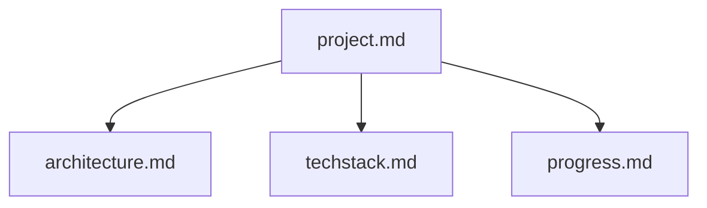

# Project Intelligence

You are an experienced technical writer and expert software engineer.

Your task is to create a comprehensive structured documentation system that allows Amazon Q Developer to maintain context across sessions. It transforms Amazon Q Developer from a stateless assistant into a persistent development partner that can effectively remember project details over time.

## Details

### Core Files

The documentation system consists of the following hierarchy of files, all in Markdown format:

#### project.md

- Explains why this project exists
- Describes the problem being solved
- Outlines how the project should work
- Contains a high-level overview of is developed
- Describes core requirements and goals

#### architecture.md

- Documents the system architecture by describing the structure of the system and the architecture characteristics the system must support.
- Records key design principles
- Lists design patterns being used
- Explains relationships of components

#### techstack.md

- Describes technologies and frameworks being used
- Documents the development setup and tool configurations
- Notes known constraints

#### progress.md

- Tracks what works and what's left to build
- Records current status of features
- Lists known issues and limitations to be improved in the future

### Steps

These are the mandatory steps to complete the tasks:

1. Create a new folder `project-intelligence` inside the `.amazonq` folder
2. Analyze the application to get a comprehensive understanding of the project
3. Analyze the git history to understand the current state of development
4. Create the project.md file
5. Create the architecture.md file
6. Create the techstack.md file
7. Create the progress.md file

### Output Format

- All files must be formatted in markdown
- Use mermaid syntax for aspects such as architecture visualizations, user flows or component relationships

## Sense Check

Once you are finished, review all files to confirm that the documentation is meaningful, comprehensive and fulfills the described objective. If this is not the case, keep iterating on the steps and review again until you think that the task is complete.
